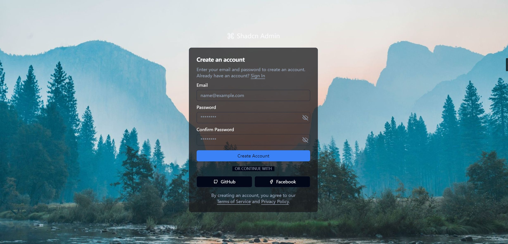
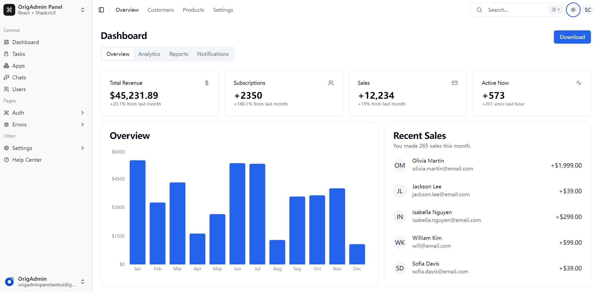

# OrigAdmin WebUI

## 🌟 Preview





## 🔧 Tech stack

This project implements the front-end Admin design based on the following technologies:

- 🛠️ [ShadcnUI](https://ui.shadcn.com/): A React UI component library that provides a set of accessible and customizable
  components.
- 🌐 [@tanstack/router](https://tanstack.com/router): A routing library for React that provides a simple and powerful way
  to handle client-side routing.
- 🚀 [RSBuild](https://rsbuild.js.org/): A modern build tool that simplifies the process of building web applications.
- 🎨 [Tailwind.v3](https://tailwindcss.com/): A utility-first CSS framework for rapidly building custom designs.
- 💡 [Postcss](https://postcss.org/): A tool for transforming CSS with JavaScript, enabling the use of plugins to extend
  CSS functionality.
- ✨ [Prettier](https://prettier.io/): A code formatter that enforces consistent style by parsing your code and
  re-printing it with its own rules.
- ⚡ [Bun](https://bun.sh/): A fast all-in-one JavaScript runtime, bundler, and package manager.
- 📜 [TypeScript](https://www.typescriptlang.org/): A statically typed programming language that builds on JavaScript,
  adding features like interfaces and generics.
- 🗃️ [React](https://reactjs.org/): A JavaScript library for building user interfaces.
- 🛡️ [ESLint](https://eslint.org/): A tool for identifying and reporting on patterns found in ECMAScript/JavaScript
  code, with the goal of making code more consistent and avoiding errors.

## 🚀 Live Demo

[OrigAdmin WebUI Live](https://shadcn-admin-design.vercel.app)

- **Username**: `admin`
- **Password**: `orig.admin`
- **Captcha**: `1234` (this is a demo, so the captcha is not validated, you can log in directly with four digits).
-
- You can change the **Username** and **Password** in the `src/pages/auth/index.tsx` file.

## 📚 Instructions for getting started with the basics

### How it works

1. Make sure it's installed on your machine: [Bun](https://bun.sh/)。
2. Clone the project to the local computer：

   ```bash
   git clone https://github.com/origadmin/shadcn-admin-design
   ```
3. Go to the project directory：
   ```bash
   cd shadcn-admin-design
   ```
4. Install dependencies：
   ```bash
   bun install
   ```
5. Start the project：
   ```bash
   bun dev
   ```
6. Open the browser and visit http://localhost:3000 to see the project.

### Script used

```
    "start": "bun run dev",
    "dev": "bun tailwind:dev && rsbuild dev --open",
    "dev:web": "bun tailwind:min && rsbuild dev --open",
    "build": "bun tailwind && rsbuild build",
    "preview": "bun tailwind:min && rsbuild build && rsbuild preview",
    "rsbuild": "bun run build",
    "tailwind": "bun tailwind:min",
    "tailwind:dev": "bunx tailwindcss --postcss -i ./src/styles/globals.css -o public/index.css",
    "tailwind:min": "bunx tailwindcss --postcss -i ./src/styles/globals.css -o public/index.css --minify",
    "shadcn": "bun x --bun shadcn@latest",
    "style:all": "bun lint && bun stylelint && bun format",
    "format": "prettier --write .",
    "format:check": "prettier -c -w .",
    "lint": "eslint .",
    "lint:fix": "eslint ./src --fix && bun format",
    "lint:strict": "eslint --max-warnings=0 ./src",
    "style": "stylelint ./src/**/*.{css}"
```

- Build the project

```
bun run build
# or
bun rsbuild
```

- Add ShadcnUI Component

```
bun shadcn add xxx
```

- Format the file

```
bun format
```

- Lint the file

```
bun lint
```

### Project features:

- ⏳ **Fast Load**: Currently, the main page loads in less than 300ms, ensuring very strong performance.
- 🚀 **High Performance**: Use Bun as a build tool to provide a fast build and hot reload experience.
- 📱 **Responsive Design**: Based on Tailwind CSS, it ensures a good user experience on a wide range of devices.
- 📈 **Scalability**: The project is clearly structured and easy to scale and maintain.
- 💻 **Modern Development**: Use TypeScript and ESLint to improve code quality and development efficiency.

## Project Description

- This project does not use Node-based backend technologies such as Next.js, Express, Nest.js and so on.
- This project does not use other build tools such as Vite.
- This project is intended to be used with the OriginAdmin backend.
- This project is designed to be used as a template for other projects.

### License

This project is licensed under [MIT License](https://opensource.org/licenses/MIT). Feel free to use and modify it, but
please keep the original author information.

### License

This project is licensed under [MIT License](https://opensource.org/licenses/MIT). Feel free to use and modify it, but
please
keep the original author information.
